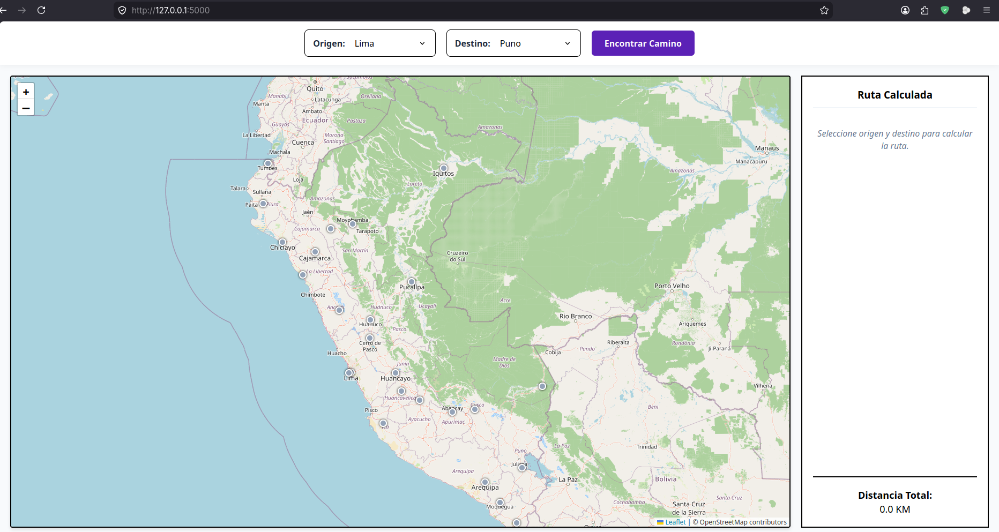
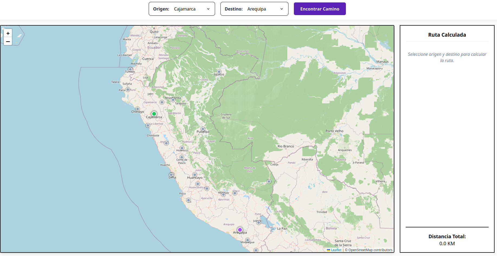
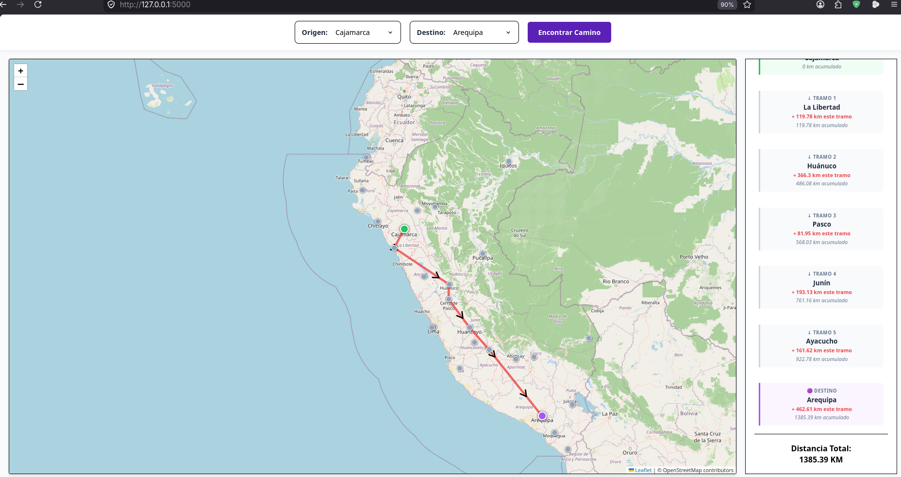

# 🗺️ Algoritmo de Dijkstra — Mapa de Rutas Perú

Aplicación web interactiva que implementa el **Algoritmo de Dijkstra** para encontrar la ruta más corta entre los departamentos del Perú, visualizada sobre un mapa real usando **Leaflet.js** y **OpenStreetMap**.

   

---

## ✨ Características

- 📍 **25 nodos** — Los 24 departamentos del Perú más la Provincia Constitucional del Callao, con las coordenadas exactas de sus capitales.
- 🔗 **Grafo bidireccional** con distancias calculadas usando la fórmula de **Haversine** (distancia real sobre la superficie terrestre).
- 🟢 Marcador de **origen** resaltado en verde.
- 🟣 Marcador de **destino** resaltado en púrpura.
- 🔴 **Flechas animadas** dibujadas sobre el mapa que muestran la ruta más corta encontrada.
- 📊 **Panel lateral** con el desglose del recorrido: cada parada muestra la distancia del tramo y la distancia acumulada total.
- 🌐 100% **Open Source** y gratuito — Sin necesidad de API Keys.

---

## 🗂️ Estructura del Proyecto

```
algotimodijkstra/
│
├── app.py              # Servidor Flask y API REST
├── dijkstra.py         # Implementación pura del Algoritmo de Dijkstra
├── datos_peru.py       # Coordenadas de capitales y grafo de conexiones
│
├── templates/
│   └── index.html      # Interfaz web principal
│
└── static/
    ├── style.css       # Estilos de la aplicación
    └── app.js          # Lógica del mapa (Leaflet.js) e interacción
```

---

## ⚙️ Requisitos Previos

- **Python 3.8** o superior
- **pip** (gestor de paquetes de Python)

Verifica que los tengas instalados:

```bash
python3 --version
pip3 --version
```

---

## 🚀 Instalación y Ejecución

### 1. Clona o descarga el proyecto

```bash
git clone <url-del-repositorio>
cd algotimodijkstra
```

### 2. Instala la dependencia Flask

```bash
pip install flask --user
```

> Si tu sistema no permite instalaciones globales (por ejemplo en distribuciones Debian/Ubuntu modernas), usa un entorno virtual:
> ```bash
> sudo apt install python3-venv python3-full -y
> python3 -m venv venv
> source venv/bin/activate
> pip install flask
> ```

### 3. Inicia el servidor

```bash
python3 app.py
```

Verás una salida similar a esta:
```
 * Serving Flask app 'app'
 * Debug mode: on
 * Running on http://127.0.0.1:5000
```

### 4. Abre la aplicación en tu navegador

```
http://127.0.0.1:5000
```

---

## 🖥️ Cómo Usar la Aplicación

1. **Selecciona el Origen** — Elige el departamento de partida en el selector `Origen`.  
   → El marcador en el mapa cambiará a 🟢 **verde**.

2. **Selecciona el Destino** — Elige el departamento de llegada en el selector `Destino`.  
   → El marcador en el mapa cambiará a 🟣 **púrpura**.



3. **Presiona "Encontrar Camino"** — El algoritmo de Dijkstra calculará la ruta más corta.  
   → Se dibujarán **flechas rojas** sobre el mapa mostrando el recorrido.



4. **Consulta el Panel Lateral** — Verás el detalle del recorrido:
   - Nombre de cada parada
   - Distancia del tramo recorrido (`+ X km este tramo`)
   - Distancia total acumulada (`Y km acumulado`)
   - Distancia total del viaje al final



---

## 🧠 Cómo Funciona el Algoritmo

El archivo `dijkstra.py` contiene una implementación limpia y pura del algoritmo:

1. Se inicializan todas las distancias como `∞` excepto el nodo origen (`0`).
2. Se usa una **cola de prioridad (min-heap)** con `heapq` para siempre procesar el nodo más cercano primero.
3. Por cada nodo, se revisan sus vecinos y se actualiza su distancia si se encontró un camino más corto.
4. Al finalizar, se reconstruye el camino óptimo recorriendo hacia atrás el diccionario de predecesores.

Las distancias del grafo son calculadas con la **fórmula de Haversine**, que computa la distancia real entre dos puntos de la Tierra dados en latitud/longitud.

---

## 🔌 API REST

El servidor Flask expone un endpoint que puedes usar directamente:

### `POST /api/calcular_ruta`

**Request body (JSON):**
```json
{
  "origen": "Puno",
  "destino": "Lima"
}
```

**Response (JSON):**
```json
{
  "distancia_total": 847.5,
  "ruta": [
    { "departamento": "Puno", "lat": -15.84, "lng": -70.02, "distancia_tramo": 0, "distancia_acumulada": 0 },
    { "departamento": "Cusco", "lat": -13.52, "lng": -71.96, "distancia_tramo": 312.4, "distancia_acumulada": 312.4 },
    { "departamento": "Lima",  "lat": -12.04, "lng": -77.04, "distancia_tramo": 535.1, "distancia_acumulada": 847.5 }
  ]
}
```

---

## 🛠️ Tecnologías Utilizadas

| Tecnología | Rol |
|---|---|
| **Python 3** | Lenguaje de backend |
| **Flask** | Servidor web y API REST |
| **Leaflet.js** | Renderizado del mapa interactivo |
| **OpenStreetMap** | Proveedor de tiles del mapa (gratuito) |
| **Leaflet.PolylineDecorator** | Flechas direccionales sobre la ruta |
| **Haversine** | Cálculo de distancias reales entre coordenadas |

---

## 📄 Licencia

Este proyecto es de uso libre para fines educativos y de demostración.
